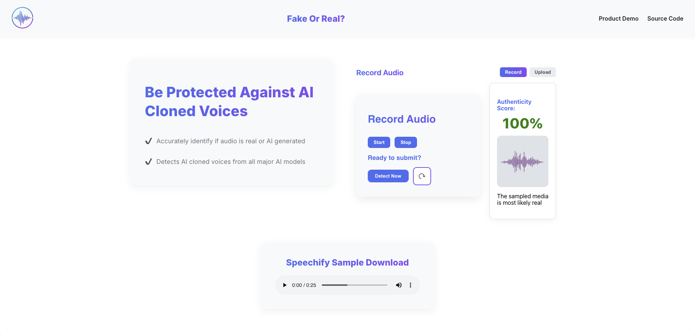

<!-- PROJECT LOGO -->
 

  <h1 align="center">Audio Deepfake Detection – Application Overview</h1>
  

    A full-stack audio deepfake detection applicaiton that utilizes a fine-tuned hugging face transformer to detect AI-generated speech.
     
    Built to help identify deepfake audio in real time, with an intuitive upload interface and clear prediction results.
     
     
    <a href="https://audio-deepfake-detector.vercel.app/"><strong>Live Demo »</strong></a>
     
     
    <a href="https://github.com/moultriedanger/audio-deepfake-detector-frontend">Frontend Repo</a>
    &middot;
    <a href="https://github.com/moultriedanger/audio-deepfake-detector-api">Backend Repo</a>
  

---

---

## 🔹 Features

### Frontend
- React for modern ui
- Drag-and-drop or file picker for audio uploads
- Real-time progress indicator during model inference
- Clear real/fake probability output
- Deployed with vercel

### Backend
- Flask RESTful API
- PyTorch-based synthetic voice detection model
- Deployed with Heroku

---

## 📌 Tech Stack

**Frontend**: React, JavaScript, JSX, CSS 
**Backend**: Python, Flask, PyTorch, boto3, NumPy 
**Deployment**: Vercel (Frontend), Heroku / Gunicorn (Backend)

---

## 📧 Contact

Moultrie Dangerfield – moultriedanger@gmail.com  
[LinkedIn](https://www.linkedin.com/in/moultriedangerfield) | [GitHub](https://github.com/moultriedanger)
